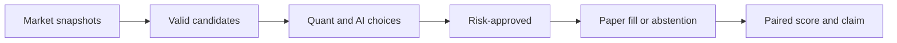

# App contract

The app is a read-only evidence viewer, not an agent control room. Its first
screen answers: **did AI add value over the same quant strategy?** All displayed
values come from event-ledger and claim-manifest artifacts.

Replay, research, and paper runs are visibly labeled. Replay is excluded from
the scored scoreboard. The local server binds to loopback by default and never
renders secrets or raw provider/broker responses.

## Views

1. **Scoreboard** — paired cumulative net outcome, drawdown, changed decisions,
   abstentions, coverage, sample count, inference cost, and evidence state.
2. **Last Decision** — frozen snapshot ID, quant and AI choices side by side,
   disagreement/abstention, risk verdict, and Alpaca status timeline.
3. **Decision Ledger** — filterable choices, counterfactual results, vetoes,
   refusals, fills, reconciliation, model version, and data provenance.
4. **Falsification Lab** — active hypotheses, trial count, sensitivity results,
   and a permanent graveyard of contradicted strategies.
5. **Claims** — displayed value, source artifact, reproduction command, status,
   and last verification time, including unsupported and retracted claims.

The candidate funnel is visible where useful:

## Demo contract

A credential-free seeded replay must complete the full evidence path when the
market is closed or Alpaca/OpenRouter is unavailable. A live run may replace the
snapshot and AI output, but must use the same deterministic pipeline.

Recommended demonstration:

1. Freeze one Alpaca market snapshot and candidate set.
2. Reveal quant choice and AI choice or abstention.
3. Show the shared risk gate and Alpaca proof timeline.
4. Replay the evidence trail and counterfactual scores.
5. Finish on aggregate incremental value and one rejected hypothesis.

Public sharing may generate one evidence card with decision count, AI changes,
paired net effect, harms, abstentions, inference cost, and sample warning. It
must link to the claim ledger and must not imply statistical proof.

## Competition-informed choices

Public submissions informed presentation, not performance claims:

- [Vetoed](https://lablab.ai/ai-hackathons/alpaca-ai-trading-agents-hackathon/vetoed/vetoed-an-agent-most-useful-when-it-says-no) motivates a readable candidate/veto funnel.
- [Aegis](https://lablab.ai/ai-hackathons/alpaca-ai-trading-agents-hackathon/aegis-labs/aegis-a-trading-agent-you-can-audit) motivates proposal-bound approvals and replayable governance evidence.
- [EdgeStack](https://lablab.ai/ai-hackathons/alpaca-ai-trading-agents-hackathon/edgestack-ai/edgestack-evidence-gated-trading-agent) motivates a visible failed-strategy graveyard.
- [Options Sniper](https://lablab.ai/submissions/sg8cnko85w6s1ssafl9bdiqw) motivates an Alpaca activity timeline and credential-free demo.
- The [Lablab apps gallery](https://lablab.ai/apps) informed the choice to
  differentiate ARGUS through paired incremental-value evidence.

These are submission descriptions, not independently verified strategy results.
